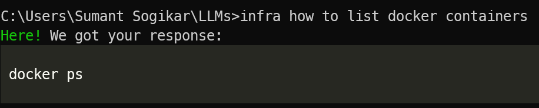

# InfraAI
 A minimalistic AI assistant designed to assist infrastructure engineers and developers with various tasks related to infrastructure management, deployment, and development. 

🔭 InfraAI is a command-line tool designed to provide immediate concise responses. It leverages the capabilities of Google's Gemini models to deliver precise commands tailored to various operating systems and environments.


## Features 🌟

- **Streamlined Command Assistance**: Get specific commands for your operating system without unnecessary clutter.
- **Support for Multiple Gemeini Models**: Choose between different Gemini models
- **Easy Configuration**: Simple commands to set your API key and preferred Gemini model.


## Installation 🛠️

To install InfraAI, simply use pip. Ensure you have Python 3.9 or later installed.

```bash
pip install infraai
```

## Configuration 🔧

Before you start using InfraAI, you need to configure your Google Gemini API key. 

### Setting the API Key

```bash
infra --setkey
```

When prompted, enter your Google Gemini API key. This key will be saved and used for future requests.

### Setting the Gemini Model

If you want to use a different model than the default Gemini-pro, you can set it as follows:

```bash
infra --set-model gemini-1.5-flash
```

This command will save your model choice and use it for all future inquiries.

## Usage 📝

To use InfraAI, simply type `infra` followed by the command or query you need help with. Here’s how it works:

```bash
infra infra how to list docker containers
```


### Examples

Here are a few examples of how you can use InfraAI to get help with common infrastructure tasks:

- **Setting up nginx**:
```bash
infra setup nginx webserver
```

- **Initializing a Git repository**:
```bash
infra how to initialize git repository
```

- **Creating a Python virtual environment**:
```bash
infra create python virtual environment
```